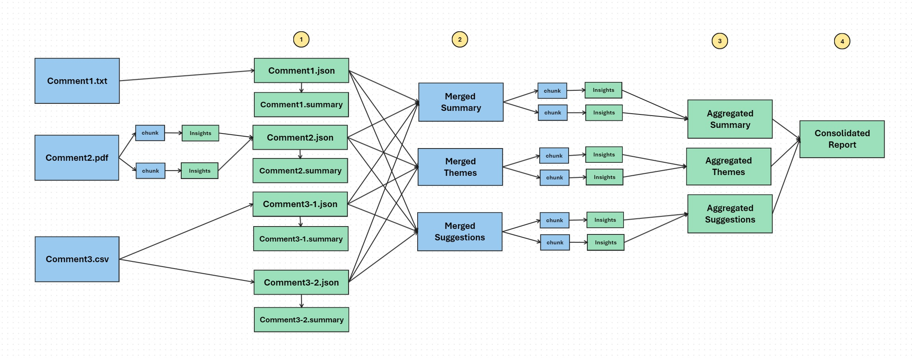

# Comment Analytics

Feedback or comment collection is a cornerstone of operational excellence for all types of organizations, whether they are federal agencies, compliance-driven entities, or commercial enterprises. Each has unique goals, but all share a common need to understand stakeholder perceptions, identify areas for improvement, and make data-driven decisions to enhance policies, processes, and outcomes. Feedback topics can span diverse areas such as regulatory rules, compliance procedures, public services, or commercial products, providing insights critical to their missions.

## Insights from Comments/Feedback

Feedback provides organizations with valuable insights to enhance their offerings by understanding stakeholder perspectives. Key takeaways include:

- **Themes**: Identifying recurring topics or issues that stakeholders frequently mention.
- **Popular Themes**: Highlighting the most discussed areas to prioritize what matters most to users.
- **Sentiment**: Gauging the overall tone—positive, neutral, or negative—to assess stakeholder satisfaction.
- **Suggestions**: Collecting actionable ideas from stakeholders for potential improvements.
- **Concerns**: Pinpointing specific pain points that need to be addressed promptly.
- **Likes and Dislikes**: Understanding what stakeholders appreciate and what they find frustrating.

Analyzing these elements helps organizations prioritize actions and align better with stakeholder expectations.

## Solution

We followed the approach outlined below and have shared all the code in this repository:

### Supported file types
- PDF
- Text
- CSV : Where each line is treated as seperate Comment

### Solution Approach

#### 1: Extract insights from individual comment
- We extract insights from individual comment. In CSV, we treat each line as seperate comment.
- We chunk the comment if it has text larger than specified size. This is configurable.
- We generate JSON with all the extracted insights. In this solution we extract 
  - Summary : Summary of the overall comment.
  - main_themes : Identify themes and brief summary for each theme. You can  speficy pre defined theme categories if you are inly interested about spefic themes. 
  - aspect_based_sentiment : Sentiment score for each theme
  - Suggestions : Suggestions or remediations mentioned in the feedback

##### Note: 
This is the critical step for the solution. Make sure to extract all relevant insights from each comment. If you have lots of comments, this could take time. You can leverage Batch API for this. Once you have the individual comments processed, you will most likely playing with these insights multiple times, to generate actionable analytics and meaningful reports. 

Refer to the sample generated json here:

Sometimes, you may need to generate summary of the individual comment. Our solution generates that too and you can refer sample individual comment summary here: 

#### 2: Merge the individual comment's JSON files
- We merge summary, themes and suggestions from each comment jason file into 3 seperate files. This is merging the text as is. 
  - **Merged Summary**
  - **Merged Themes**
  - **Merged Suggestions**
- This way we can extract insights from each segment seperately. Ex: to identify popular themes or suggestions etc 

#### 3: Generated aggregated insights from Merged files
- Generate final aggregated outputs:
  - **Aggregated Summary**:
    - A comprehensive summary of all comments.
  - **Aggregated Themes**:
    - We consolidate themes and generate Top 25 most occuring themes.
    - We have also played with several other options.
     - Categorize themes for easier consumption
     - Occurence count. This does not work if you have too many themes. As the LLM's input and output tokens limit increases, you als get to support larger number of themes. 
  - **Aggregated Suggestions**:
    - A consolidated list of suggestions for improvement.

Refer to the sample generated aggregated insights here:
#### 4: Generate final consolidated report(Executive Summary)
- Combine all aggregated outputs into a **Consolidated Report**, which includes:
  - Summaries
  - Themes
  - Suggestions

Refer to the sample generated consolidated report here:
