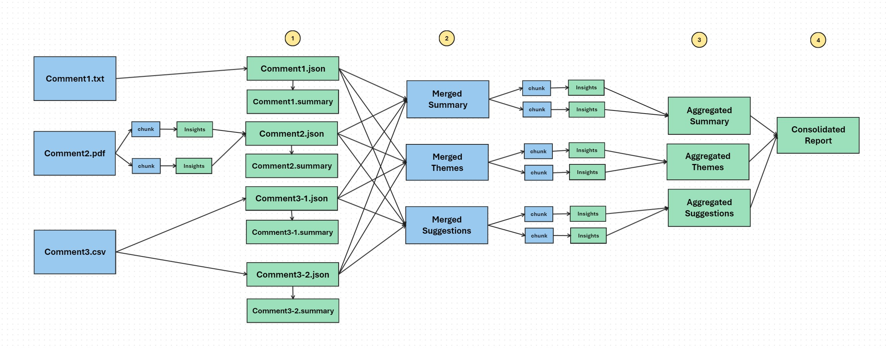

# Comment Analytics

Feedback or comment collection is a cornerstone of operational excellence for all types of organizations, whether they are federal agencies, compliance-driven entities, or commercial enterprises. Each has unique goals, but all share a common need to understand stakeholder perceptions, identify areas for improvement, and make data-driven decisions to enhance policies, processes, and outcomes. Feedback topics can span diverse areas such as regulatory rules, compliance procedures, public services, or commercial products, providing insights critical to their missions.

## Insights from Comments/Feedback

Feedback provides organizations with valuable insights to enhance their offerings by understanding stakeholder perspectives. Key takeaways include:

- **Themes**: Identifying recurring topics or issues that stakeholders frequently mention.
- **Popular Themes**: Highlighting the most discussed areas to prioritize what matters most to users.
- **Sentiment**: Gauging the overall tone—positive, neutral, or negative—to assess stakeholder satisfaction.
- **Suggestions**: Collecting actionable ideas from stakeholders for potential improvements.
- **Concerns**: Pinpointing specific pain points that need to be addressed promptly.
- **Likes and Dislikes**: Understanding what stakeholders appreciate and what they find frustrating.

Analyzing these elements helps organizations prioritize actions and align better with stakeholder expectations.

## Solution Approach

We followed the approach outlined below and have shared all the code in this repository:

