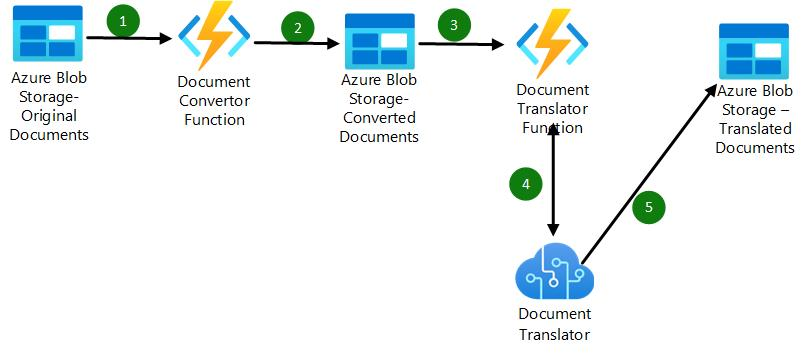

# Translate documents using Azure Document Translation

Azure Document Translation service enables the translation of multiple and complex documents across all supported languages and dialects while preserving the original document structure and data format. However, it currently does not support the translation of text from images in digital documents. To address this, there are two options:
* Convert the digital document into a scanned document in its entirety.
* Split the document into two files and process them separately:
    * One file containing all pages that only have text. The digital pages are preserved in their original form. The Document Translation service takes advantage of the structure/layout information from the digital text page and translates it more accurately than a scanned page.
    * The second file will contain a scanned version of all the pages that contain images. 
    * Note: As we have processed these files by parsing the original document page by page, we have the required information to stitch the translated documents into a single translated document. This codebase does not have that code. We will add that code in the near future. If you have the time to help, please let us know.

## Dealing with various File Types  
You will need to handle different file types as follows:
* PDF
    * Scanned PDF:You do not need to do anything. Translator service translates all the text from the scanned pages.
    * Digital PDF: As mentioned earlier, the Translator service does not translate text from images, but it can translate the remaining text.
    * This solution analyzes each page and creates multiple files based on the content on each page (text only page, text plus image page, image only page, etc.). You can configure this behavior through various parameters. The following files will be created:
        * A copy of the original file as is.
        * A scanned version of the whole document.
        * Two other files: One containing all pages that only have text, and a second file with a scanned version of all the pages that contain image(s).
        * Note: The Azure Document Translator has a limit of 40MB per document. The scanned version of the file is typically larger. Therefore, we split the scanned document into multiple files based on the number of pages (configurable).
* Image Files(BMP,PNG,JPG)
    * We need to convert these files into PDF, and this solution takes care of it.
* Office files (Word, Powerpoint, Excel)
    * The Translator service handles these files in the same way as PDF, meaning it does not translate text from images but translates the remaining text. Therefore, we need to convert/process these files in the same way as PDF. One approach is to convert office files into PDF and leverage the solution we have for PDF. 
    * There are several open-source Python packages available to convert office documents, but some of them require Microsoft Office to be installed on the machine where the code runs. You can explore the following options
        * https://pypi.org/project/aspose-words/
        * https://github.com/AlJohri/docx2pdf
        * You can also leverage Power Apps, as long as the files are stored in OneDrive.

##########
## Solution Approach  

We took the following approach and all the code is shared in this repository.

Both the functions get [triggered using an event subscription from the storage container.](https://learn.microsoft.com/en-us/azure/azure-functions/functions-event-grid-blob-trigger?pivots=programming-language-python)
## Document Convertor Function

we have two options here. One is based on PyMuPDF python package and another is based on pdf2image python package. 
* pdf2image function requires docker as we need to install poppler utils which is not available as Python package. This function only supports converting the PDF document to scanned version
* PyMuPDF based function has extensive functionality and configurable options.Following are the configurations
    * "translatordocs_storage: "storage connecttion string for input and converted data",
    * "pdf_conversion":"all OR scanned OR original or hybrid",
        * scanned : Create scanned version of the document. Name of the scanned file will have "--scanned" appended to original file.
        * oroginal: copy the original  the document
        * hybrid: 
            * For pages with text only data, create a file with the digital copy of the pages. Name of the text pages file will have "--textonlyPage" appended to original file. Note that if the document has no pages with only text, this file will not be created.
            * For pages with images or images and text, create a file with the scanned versio copy of the pages. Name of the image pages file will have "--ImagePages" appended to original file. Note that if the document has no pages with images, this file will not be created.
        * all: Create all of the above. 
    * "pdf_page_limit":"no of pages in one file for scanned version"
        * There is a limit of 40MB per file for Azure Document Translator. adjust this page number based on the type of PDF files you are dealing with
    * "output_container_name":"Output Container for converted documents"

### Note
* Hybrid is the best option. This is because Translator can translate digital pages better than images as it can get the proper word block and full layout information. 
* As we are processing the original file page by page, we can create a mapping file that defines mapping of original document page to converted documen's pages(imagepages and textonlypages documents). we can use this mapping to stitch these documents and generate final translated document. We did not get to this. Hopefully we will get some time soon to take care of this. 

## Document Translator Function

This is a simple function that takes a document and submits to translator service. Translator service stores the translated document to specified container. 
Following are the configurations
* "converteddocs_storage": "storage connecttion string for input documents",,
* "translator_endpoint":"translator service endpoint",
* "translator_key":"translator key",
* "target_blob_url":"target blob url for translated output"

### Note
* Currently we have hardcoded the target language. You can make it configurable option.
* We are also leveraing auto language dectection by Translator service to identify source language.You get better accuracy if you can specify source language.[Refer this link] (https://learn.microsoft.com/en-us/azure/cognitive-services/translator/document-translation/faq#should-i-specify-the-source-language-in-a-request) 
* we generate multiple files when we are dealing with large documents as mentioned above. So you need to merge them into single file. 

## Deployment    

To deploy this solution :
1. Create Azure Translation Service.
2. Create Storage account to store original, converted and translated documents
3. Create Azure functions based on the source code from this repository. [Refer to this article to create functions that leverage storage container's event subscription ](https://learn.microsoft.com/en-us/azure/azure-functions/functions-event-grid-blob-trigger?pivots=programming-language-python)

## Contributors
+ Brandon Rohrer 
+ Krishna Doss Mohan 
+ Narasimhan Kidambi
+ Nicolas Uthurriague
+ Sreedhar Mallangi 
