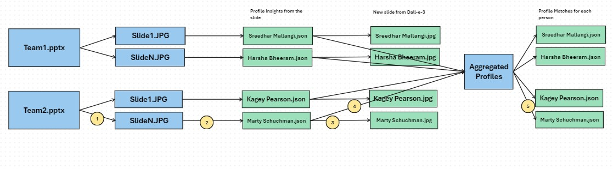

# Profile Match : Having Fun with AOAI!

This was such a cool little project where we got to mess around with AOAI and do some pretty awesome stuff. Here’s the gist of what we did
- 🖼️ Turning Images into Stories: We took images that had some text and pictures of people, and pulled out all the interesting details about them. Each slide told us who they are, what they’re into, what they do for fun—basically their whole vibe. Then we asked GPT to do something fun: figure out which superhero they’d be and recommend them a food to try. (Because why not? 🦸‍♂️🍩)
- 🎨 Making New Images: Once we had all their info in a nice little JSON file, we used DALL-E 3 to whip up a brand-new image for each person. It’s like turning data into art—super fun to see how it all came out!
- 🤝 Finding Connections: After all that, we compared everyone’s profiles to find people who might click—shared interests, similar skills, or just an overall match. It felt kind of like playing matchmaker, but for hobbies and talents.

The whole point of this? To have a blast with AOAI, try out some new ideas, and learn how powerful (and fun!) this tool can be.

## Solution

We followed the approach outlined below and have shared all the code in this repository:

1. Save the PPTX as JPG. Each slide will be saved as jpg(Slide1.jpg, slide2.jpg etc). This is manual process. There are paid python packages that does  this conversion.
2. Leveraging AOAI GPT Model, extract information from the image. This includes both the text on the image and also information from the pictures on the image. Extract this info as JSON
3. Leveraging AOAI Dall-e-3 model, generate a new image based on the information from Profile JSON from previous step.
4. Aggregate all the Profile JSONs into a single file. 
5. For each Profile, run through all the profiles and identify most similar profiles using AOAI. Identify most similar profiles based on interests, skills, personality and overall summary. Leveraged AOAI GPT model for this as the number of profiles are low. 

## Note
Code needs to be updated with the following
- We used JSON mode to generate JSON file while extracting profile info from image. Even though we get the output as JSON, there are at times we do not get it in the required schema(rare but happens). We need to use Structured Outputs so that we can generate JSON based on pre defined schema
- You may run into content_policy_violation while generating images using Dall-e-3.
- You can use Cosine similarity to identify most similar matches.

## Contributors
- Kagey Pearson 
- Harsha Beeram
- Sreedhar Mallangi
